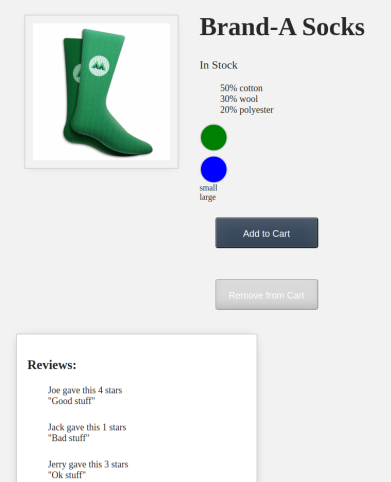

# sreed-web-programming

Web programming project using Vue JS to create a simple store web application.

[Tutorial series followed](https://www.vuemastery.com/courses/intro-to-vue-3/forms-and-v-model-vue3)

This project uses [Vue Single File Components](https://v3.vuejs.org/api/sfc-spec.html), which in general must be built into the project using `vue-cli`.

[Axios](https://github.com/axios/axios) is also used to read a static JSON file to populate reviews on the product.




## Project setup

Using [NodeSource PPA on Ubuntu](https://nodesource.com/) to install latest version of `nodejs` and `npm`

```bash
curl -fsSL https://deb.nodesource.com/setup_16.x | sudo -E bash -
sudo apt install nodejs
sudo npm install -g npm
git clone git@gitlab.com:shaunrd0/sreed-web-programming.git
cd sreed-web-programming
npm install
```

The following instructions were (mostly) automatically generated by running `vue-cli create sreed-web-programming`.

### Serve Application for Development
```
npm run serve
```

### Compiles Application for Production
```
npm run build
```

### Lints and fixes files
```
npm run lint
```

### Customize configuration
See [Configuration Reference](https://cli.vuejs.org/config/).

